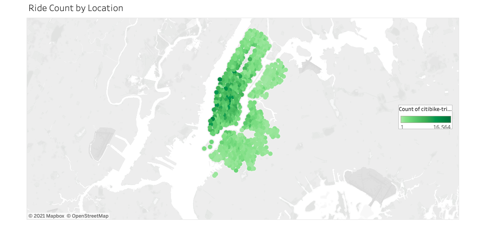
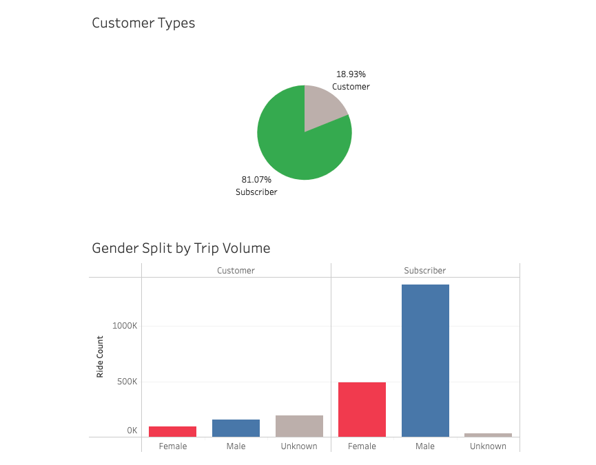
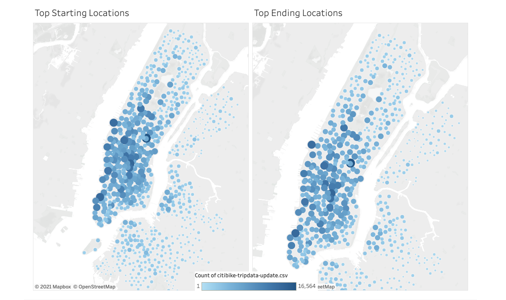
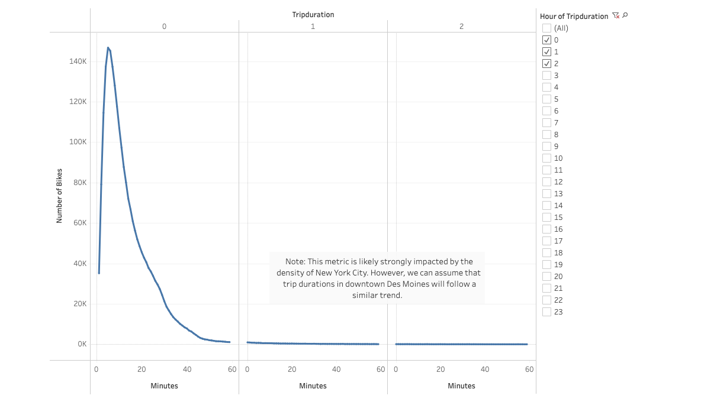
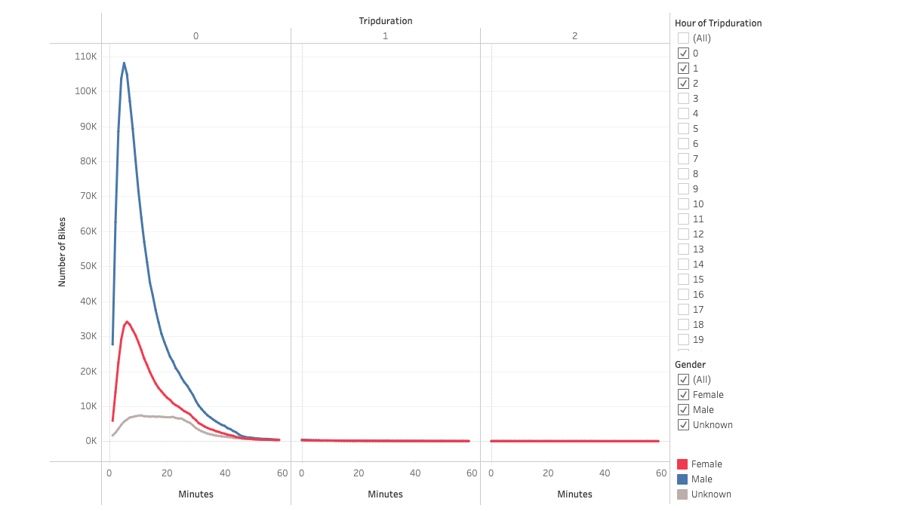
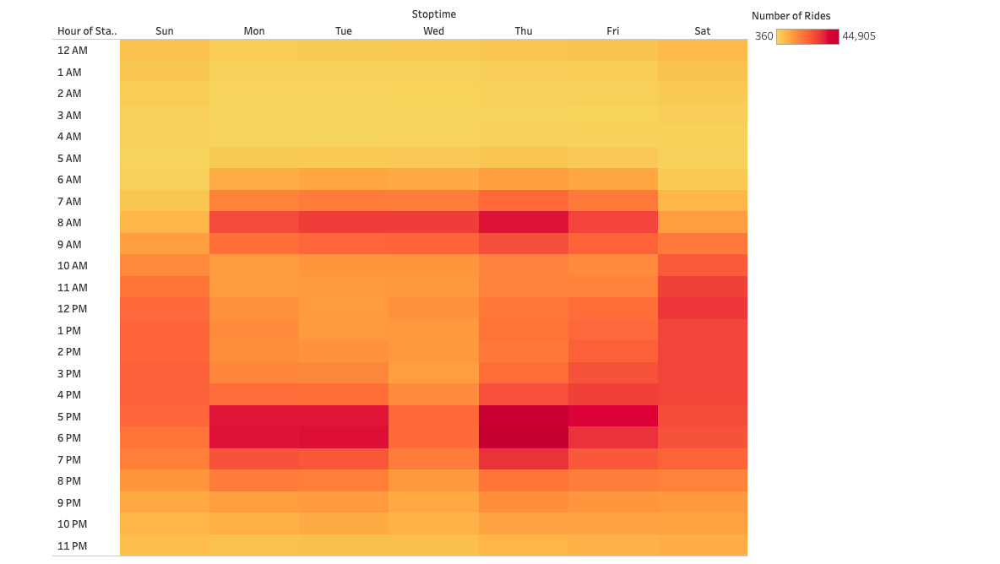
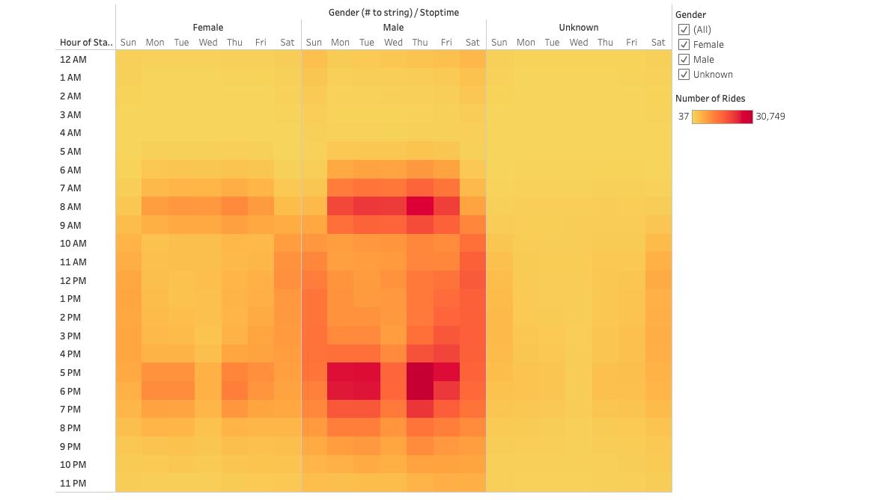
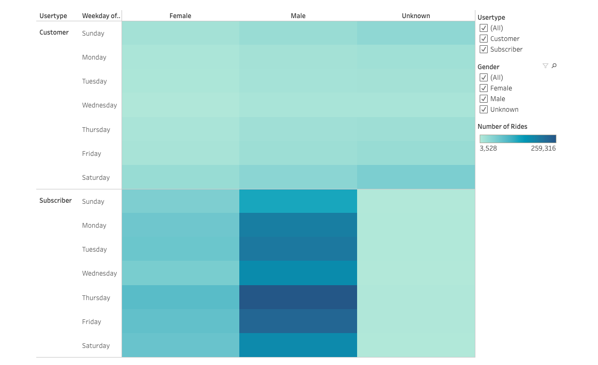

# bikesharing
# Overview: 
Use Tableau to help Kate to analyze and figure out how Bike Share business is work in NYC then create a proposal on how Bike Share is going to work with Des Moines.

# Results: We can see the results via dashboard: [Link to dashboard](https://public.tableau.com/app/profile/jenny4061/viz/CitiBikeChallenge_16236940339070/CitiBikePresentation)

## 1. Ride count by location:

## 2. Customer Types:

## 3. Starting and Ending location:

## 4. Trip Duration

## 5. Trip Duration with gender:

##  6. Stop time:

## 7. Stop time with gender:

## 8. Stop time with gender and customer types:

# Summary:
After analyzing, Citibike has provided more than 2 has provided more than 2 million rides during the time period. It cover 80% of the customers. The majority length of each trip is less than 30 minutes. There is a suggestion to the analyze is they should analyze based on the customer age so the company can provide the bike for bikes that are suitable for all ages as well as expanding the customer market. 

